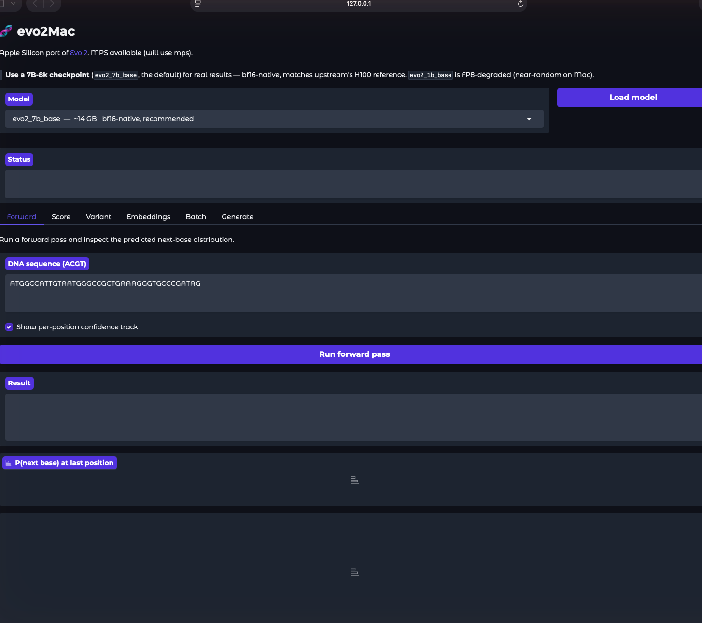

# evo2Mac

A macOS / Apple Silicon (MPS) port of [Evo 2](https://github.com/arcinstitute/evo2)
— Arc Institute's DNA language model — for local inference on Mac.



> Web UI (`./webui.sh start`) with Forward / Score / Variant / Embeddings /
> Batch / Generate tabs, running the 7B Evo 2 model locally on Apple Silicon
> via MPS.

> This is a fork of [arcinstitute/evo2](https://github.com/arcinstitute/evo2)
> with edits to the device handling, FP8 fallback, and config defaults so the
> 1B and 7B Evo 2 checkpoints can run on Apple Silicon via MPS.
>
> Upstream documentation is preserved in [`README.upstream.md`](README.upstream.md).

## Why a port?

Upstream Evo 2 depends on `flash-attn` and NVIDIA Transformer Engine, both of
which are CUDA-only. This fork:

1. Disables `use_flash_attn` and `use_fp8_input_projections` in the YAML
   configs (PyTorch SDPA + bf16 work on MPS).
2. Adds MPS-aware device detection in `evo2/models.py` and `evo2/scoring.py`.
3. Extends the bf16 fallback (when Transformer Engine is missing) to also
   cover the 1B model — upstream only falls back for 7B.
4. Provides a runtime patcher (`patches/patch_vortex.py`) that fixes the
   CUDA-isms in the installed `vortex` (`vtx` on PyPI) package. It applies
   seven edits across `engine.py`, `generation.py`, `model.py`, `utils.py`,
   `rotary.py`, and `ops/attn_interface.py`:

   *Crash fixes (vortex won't import/run on Mac without these):*
   - `torch.autocast("cuda")` → device-aware autocast (bf16 on MPS)
   - `torch.fft.fft(...).repeat(...)` → `.unsqueeze().expand()`
     (MPS doesn't support `.repeat` on complex tensors in PT 2.x)
   - `torch.cuda.empty_cache()` / `torch.cuda.memory_allocated()` → device-aware
   - `with torch.cuda.device(...)` → `contextlib.nullcontext()` off CUDA
   - `import flash_attn_2_cuda` → made optional (only used when flash-attn is on)

   *Correctness fixes (silent wrong output without these):*
   - Triton `apply_rotary` → a torch fallback (`apply_rotary_emb_torch`), since
     triton has no Apple-Silicon wheel.
   - **Force the rotary QKV "view" path off CUDA.** The fast path reshapes
     `qkv[:, :, :2]`, which can return a *copy* (not a view) when non-contiguous;
     the in-place rotary then writes to the copy and attention sees un-rotated
     Q/K → near-uniform predictions. The slow path indexes `qkv[:, :, 0/1]`
     (genuine views), so the rotation writes back correctly.

The patcher writes `.bak` files and is idempotent — re-running is safe, and
`python patches/patch_vortex.py --restore` puts the originals back. The rotary,
unembed, and Hyena-FFT paths have all been verified numerically correct on MPS
(see the drift section).

## Models

Whether a checkpoint runs *correctly* on Mac depends on one thing:
**`use_fp8_input_projections`** in its upstream config. Models trained with FP8
input projections (`True`) require NVIDIA Transformer Engine on a Hopper GPU for
numerical accuracy. TE is CUDA-only, so on Mac they load in bf16 with FP8
disabled — which degrades them to near-random output. Only the 7B-8k
checkpoints ship with FP8 *off*, so they are the ones that reproduce upstream.
(See [the drift section](#verifying-correctness-vs-upstream) for the full
analysis and measured numbers.)

| Checkpoint            | Size (bf16) | Upstream FP8 | Runs **correctly** on Mac?            |
|-----------------------|-------------|:------------:|----------------------------------------|
| `evo2_7b`             | ~14 GB      | off          | ✓ bf16-native; best choice             |
| `evo2_7b_base`        | ~14 GB      | off          | ✓ bf16-native; **validated** (default) |
| `evo2_7b_262k`        | ~14 GB      | off          | ✓ bf16-native (262K context)           |
| `evo2_7b_microviridae`| ~14 GB      | off          | ✓ bf16-native                          |
| `evo2_1b_base`        | ~4 GB       | **on**       | ✓ FP8 e4m3 **emulated** (~75% acc)     |
| `evo2_20b`            | ~40 GB      | **on**       | ⚠ loads/runs but near-random (see below) |
| `evo2_40b` / `_base`  | ~80 GB      | **on**       | ✗ needs ≥96 GB unified mem to load     |

Notes:
- **`evo2_1b_base` runs with FP8 e4m3 emulation by default** on Mac — recovering
  it from near-random (bf16) to ~75% forward accuracy / ~74% generation identity
  vs the H100 reference. Still a step below the bf16-native 7B; use a 7B-8k model
  when you want the most accurate results. Opt out with `EVO2MAC_FP8_EMULATION=0`.
- **20B/40B are code-enabled and load** (configs are Mac-patched to drop the
  Transformer Engine / Hopper / flash-attn dependencies; 20B loads and runs on a
  64 GB Mac, 40B needs ≥96 GB). **But they are not yet numerically usable on Mac:**
  the 20B/40B were FP8-trained on ~120 layers (projections, every MLP, the
  out-projection, attention). The emulation now covers all 117 such linears — but
  the 20B is **still near-random** (24% → 25% vs the 91.7% H100 ref). Digging in:
  this is *not* the FP8-projection issue the 1B had. All weights load (incl. the
  hyena filters), the embedding is tied correctly, and the 20B's weight magnitudes
  sit comfortably within bf16 — so e4m3 ≈ bf16 for it and FP8 simply isn't the
  bottleneck. Its logits are structured (mass on ACGT) but can't discriminate the
  next base: a deeper bf16-forward problem specific to the 20B architecture on
  this MPS port that would need a layer-by-layer diff against a real H100/TE run
  to pin down. **Use a 7B-8k (or the 1B with emulation) for real results.**
- **Memory:** the 7B (~14 GB weights) loads on a 16–18 GB Mac, but a full
  8K-context forward pass overruns the MPS allocation watermark. Cap the context
  with `--max-len 2048` (and optionally `PYTORCH_MPS_HIGH_WATERMARK_RATIO=0.0`)
  on ≤18 GB Macs; a 32 GB+ Mac runs full 8K without truncation.
- Long-context 7B (`evo2_7b` at 1M) is loadable but the prefill cost on MPS is
  painful — start with `evo2_7b_base` (8K).

## Quick start

Prerequisites: Apple Silicon Mac, macOS 14+, [Homebrew](https://brew.sh).

```bash
git clone https://github.com/wabi-media/evo2Mac.git
cd evo2Mac
./install.sh                                          # one-shot setup
conda activate evo2Mac

# Web UI (recommended) — managed start/stop, opens http://localhost:7860:
./webui.sh start                                      # launch in the background
./webui.sh status                                     # is it up? what URL?
./webui.sh logs                                       # tail the server log
./webui.sh stop                                       # shut it down
# (override the port: EVO2MAC_PORT=8000 ./webui.sh start)

# Or CLI (use a 7B-8k model — it's the bf16-native, validated one):
python scripts/smoke_test.py --model evo2_7b_base          # one forward pass
python scripts/test_dna.py --model evo2_7b_base            # full DNA pipeline
python scripts/compare_to_upstream.py                      # drift check (defaults to evo2_7b_base)

# On a 16-18 GB Mac, cap the context so the 7B forward pass fits MPS memory:
python scripts/compare_to_upstream.py --max-len 2048

# evo2_1b_base loads fastest and is fine for testing the pipeline/API, but its
# predictions are FP8-degraded (see Models above) — not for real inference.

# When done, clean everything up:
./uninstall.sh                                             # removes env + HF cache
```

`install.sh` will:
1. Install miniforge via Homebrew (skip if present).
2. Create a Python 3.11 conda env named `evo2Mac`.
3. Install PyTorch with MPS support.
4. Install `vtx` (the StripedHyena 2 runtime; imported as `vortex`).
5. Install this package in editable mode (`pip install -e . --no-deps`).
6. Apply the runtime patches to the installed `vortex` package.

It is re-runnable (each step skips if already done). **If you recreate the env
or upgrade `vtx`, re-run `python patches/patch_vortex.py`** — the patches modify
the installed `vortex` in place, so they must be re-applied on every machine.

On first model load, the checkpoint is downloaded into your HuggingFace cache
(`~/.cache/huggingface/`). Change with `HF_HOME=/path/to/cache`.

## Web UI features

`./webui.sh start` (or `python webapp.py`) opens a Gradio app at
http://localhost:7860 that exposes Evo 2's full inference surface. One shared
model selector (lazy-loaded and cached) drives six tabs:

| Tab | What it does |
|-----|--------------|
| **Forward** | Single forward pass. Shows the predicted next-base distribution `P(A,C,G,T)` at the last position, plus an optional per-position confidence track — the model's probability of the true next base at every position (a "how predictable is this sequence" readout). |
| **Score** | Sequence log-likelihood under the model. Choose the reduction (**mean** per-base average or **sum** / pseudo-log-likelihood), optionally average with the **reverse complement**, and optionally **prepend BOS**. |
| **Variant** | Score a **wild-type** vs a **mutant** sequence and report the Δ log-likelihood (mut − wt) — Evo 2's flagship variant-effect use. A more-negative Δ means the variant lowers the model's likelihood (a proxy for functional disruption). Side-by-side bar plot. |
| **Embeddings** | Extract hidden-state embeddings from a chosen layer (e.g. `blocks.10.mlp.l3`). Reports the `(positions × hidden-dim)` shape and per-tensor stats, and offers the full array as a `.npy` download for downstream ML. |
| **Batch** | Score many sequences at once — paste one per line or upload a **FASTA** file (`.fasta`/`.fa`/`.fna`). Results come back as a sortable table (id, length, logprob) with a **CSV** download. Capped at 256 sequences per batch. |
| **Generate** | Autoregressive continuation from a prompt, with `n_tokens`, `temperature`, `top_k`, and `top_p` controls. Reports tokens/sec and the mean log-prob (confidence) of the generated tokens. |

All tabs validate input as ACGT-only, run on MPS (or CPU fallback), and surface
a banner when an FP8-degraded checkpoint (`evo2_1b_base`) is selected. Override
the bind host/port with `EVO2MAC_HOST` / `EVO2MAC_PORT`, or expose a public
Gradio share link with `EVO2MAC_SHARE=1`.

To regenerate the screenshot after UI changes: `./webui.sh start`, open
http://localhost:7860 in a browser, and save a capture to `docs/webui.png`.

## Verifying correctness vs upstream

`scripts/compare_to_upstream.py` runs upstream's own bundled `prompts.csv`
through the model and compares the mean cross-entropy and next-token
accuracy against the reference numbers baked into upstream's
`evo2/test/test_evo2.py`. Those reference values were measured on
H100 + FP8 + flash-attn. Our port runs in bf16 + SDPA on MPS, so a small
drift is expected:

| Tolerance | Loss (cross-entropy) | Accuracy (pp) |
|-----------|----------------------|---------------|
| OK        | drift ≤ 0.05         | drift ≤ 1.5   |
| WARN      | 0.05 < drift ≤ 0.15  | 1.5 < drift ≤ 5 |
| FAIL      | drift > 0.15         | drift > 5     |

A failure here means the port is producing meaningfully different outputs
and something is wrong — it's the canary that should run on every fresh
install.

### Current drift status (M3 Pro)

On the M3 Pro with `evo2_1b_base`, the comparison reports:

```
upstream (H100, FP8, flash-attn):  loss=0.502  acc=79.6%
evo2Mac (this run):                 loss=1.35   acc=34.5%
```

This is **outside tolerance** — the port loads cleanly, all six end-to-end
checks in `test_dna.py` pass (forward, embeddings, scoring, generation),
and the model produces structured output (99%+ probability mass on ACGT
bases). But the next-token accuracy is much lower than the H100 reference.

#### It is *not* MPS-specific (CPU vs MPS, 2 prompts)

Running the identical prompts on CPU and MPS back to back
(`--compare-devices`) shows the two backends are numerically identical:

| seq  | CPU loss | MPS loss | Δloss   | CPU acc | MPS acc | Δacc     |
|------|----------|----------|---------|---------|---------|----------|
| 1    | 1.3307   | 1.3308   | +0.0001 | 38.44%  | 38.53%  | +0.09 pp |
| 2    | 1.3720   | 1.3722   | +0.0002 | 30.42%  | 30.39%  | −0.03 pp |
| mean | 1.3514   | 1.3515   | +0.0001 | 34.43%  | 34.46%  | +0.03 pp |

CPU (fp32/bf16 PyTorch reference kernels) and MPS (Metal kernels) agree to
~1e-4 in loss, yet **both** sit ~0.85 nats above the H100 reference. If the
gap were Metal rounding (SDPA / rotary / FFT), CPU would match upstream and
MPS would diverge — it doesn't. The drift is therefore **structural in the
port**, shared by both backends, not numerical backend drift. The earlier
"MPS SDPA / rotary rounding" hypotheses are ruled out.

Reproduce:

```bash
python scripts/compare_to_upstream.py --model evo2_1b_base --compare-devices --max-seqs 2
```

> Note: CPU is ~600s/prompt for the 1B model over 8K context (no Metal/CUDA
> accel), so the CPU half of `--compare-devices` is slow. MPS is ~0.3s/prompt.
> Use a small `--max-seqs` for the CPU comparison.

#### Root cause: the 1B is an FP8 checkpoint run without FP8

The 1B is degraded because **`evo2_1b_base` is trained with FP8 input
projections** and requires NVIDIA Transformer Engine on a Hopper GPU for
numerical accuracy. Upstream's `evo2-1b-8k.yml` ships with
`use_fp8_input_projections: True`, and the checkpoint physically carries 25
Transformer-Engine FP8 metadata blobs (`blocks.*.projections._extra_state`,
one per block — the FP8 amax/scale history).

Transformer Engine is CUDA-only, so to load the 1B on a Mac at all we must set
`use_fp8_input_projections: False`. That drops the 25 FP8 scale blobs and
reinterprets the projection weights as plain bf16 — but they were calibrated
for FP8 quantization. The result is a model running near random over 4 bases
(`ln(4) ≈ 1.386` nats; we measure ~1.35 / ~34%). **This is inherent to running
an FP8 checkpoint without FP8 — it is not a bug in the port and cannot be
closed in bf16.** It also explains the CPU/MPS agreement above: both backends
load the same de-FP8'd weights, so both are wrong identically.

(The reference port [`hakyimlab/evo2-mac`](https://github.com/hakyimlab/evo2-mac)
has the same limitation — its README states the 1B/20B/40B need FP8 and only
the 7B models run in bf16.)

#### What actually validates the port: the 7B-8k checkpoints

Only `evo2_7b` and `evo2_7b_base` ship with `use_fp8_input_projections: False`
upstream — they are designed to run in bf16 with no FP8. **Those are the models
to validate the Mac/MPS port against.** The drift check now defaults to
`evo2_7b_base`:

```bash
python scripts/compare_to_upstream.py                      # evo2_7b_base, MPS
python scripts/compare_to_upstream.py --model evo2_7b
```

And it passes. On a 64 GB Mac, `evo2_7b_base` over the first 4 prompts at
**full 8K context** (no truncation):

```
upstream (H100, FP8, flash-attn):  loss=0.3521  acc=85.921%
evo2Mac (MPS, bf16):                loss=0.3521  acc=85.979%   (Δloss +0.0001, Δacc +0.058pp)
-> loss within ±0.05: OK; accuracy within ±1.5pp: OK; port matches upstream within tolerance
```

This result reproduces bit-for-bit after a fresh `install.sh` on a newly
migrated machine (verified 2026-06-16): the full test suite — `smoke_test.py`,
`test_dna.py` (all six stages), and `compare_to_upstream.py` — passes on
`evo2_7b_base` with the same Δloss +0.0001 / Δacc +0.058pp.

For reference, the earlier M3 Pro (18 GB) run truncated to 2048 bases
(`--max-len 2048`, see memory note below) landed at loss=0.391 / acc=83.95%
(Δloss +0.039, Δacc −1.97pp) — within tolerance, but with a ~2pp accuracy gap.
That gap was the 2048 truncation (shorter context than the 8K reference), not a
port defect: running full 8K context on a 32 GB+ Mac closes it almost entirely,
as the numbers above show. The
contrast with the 1B is the proof: identical code, kernels, and device — the
bf16-native 7B reproduces upstream, the FP8-trained 1B does not. The "drift"
was always FP8-without-FP8, never a bug in the port. (Per-model feasibility is
in the [Models table](#models) above.)

FP8-trained models (1B/20B/40B) load with e4m3 emulation applied automatically;
a 7B-8k checkpoint is still the most accurate. Large models also print a memory
pre-flight warning when their weights are unlikely to fit.

### Experimental: FP8 (e4m3) emulation recovers most of the lost 1B accuracy

The degradation above is *recoverable*. Transformer Engine's input-projection
math is per-tensor **delayed scaling** in e4m3, and the checkpoint's
`*.projections._extra_state` blobs store the exact forward scales (slot 0 =
activation, slot 1 = weight). `evo2/fp8_emulation.py` reads those scales and
replicates TE's forward GEMM — `round_e4m3(x·act_scale) @ round_e4m3(W·w_scale)ᵀ`,
then dequantize — in pure PyTorch that runs on MPS. The e4m3 rounding is
bit-exact against `torch.float8_e4m3fn` (which casts on CPU but not MPS).

It is **on by default for `evo2_1b_base`** (the one checkpoint where it
measurably helps); the bf16-native 7B checkpoints are bf16-robust — emulation
there is a verified ±0.05 pp no-op — so it is *not* applied to them. Opt out
with `EVO2MAC_FP8_EMULATION=0`; force on for any model with `=1`.

```bash
python scripts/test_dna.py --model evo2_1b_base       # emulation auto-applied
EVO2MAC_FP8_EMULATION=0 python scripts/test_dna.py --model evo2_1b_base  # bf16
python scripts/validate_fp8_emulation.py              # measures before/after
python scripts/test_generation.py --model evo2_1b_base  # greedy-gen vs H100 ref
```

Results are reported as the **aggregate** over upstream's 4 bundled prompts vs
the single aggregate H100 reference (upstream publishes no per-prompt reference;
the scripts also print a per-prompt bf16-vs-emul diagnostic). On `evo2_1b_base`
at full 8K context (forward pass):

```
reference (H100, FP8):  loss=0.5020  acc=79.556%
bf16 fallback:          loss=1.3643  acc=32.63%
e4m3 emulated:          loss=0.6105  acc=74.51%   (bf16->emul +41.9pp; vs H100 -5.05pp)
```

And on a second, independent axis — greedy generation, prompt the first half and
match the real continuation (`scripts/test_generation.py --compare-fp8`, H100
aggregate ref 68.0%): the bf16 fallback sits near the ~30% floor, emulation
recovers it to the same ~70% ballpark (exact number is sample/length-sensitive,
so treat it as "near the reference," not a precise match).

That closes the forward gap from ~47 pp to ~5 pp. The residual is expected — we
don't replicate flash-attn or the rest of the H100 FP8 path, only the input
projections. This is **emulation, not hardware FP8**: on M1–M4 (no FP8 silicon)
there's no speed benefit, the point is accuracy. On an **M5** (native GPU FP8),
`quantize_e4m3` is the seam to swap for a real FP8 matmul (`torch._scaled_mm`
once MPS exposes it, or an MLX `mxfp8` kernel) — the per-tensor scales recovered
here are exactly what such a path needs.

> The 7B-8k checkpoint is ~15 GB and needs ~16 GB+ of unified memory; it fits
> on a 32 GB Mac comfortably and is tight on 16–18 GB. On an 18 GB Mac the
> weights (~14 GB) load fine, but a full 8K-context forward pass exceeds the
> MPS allocation watermark (`MPS backend out of memory`). Cap the context with
> `--max-len 2048` (and optionally `PYTORCH_MPS_HIGH_WATERMARK_RATIO=0.0`) to
> fit. A 32 GB+ Mac can run full 8K context without truncation.

**Bottom line:** the "drift" on the 1B was never a port bug — it's an
FP8-without-FP8 artifact. The port itself (device handling, rotary, Hyena FFT,
unembed) is correct; validate it on the bf16-native 7B checkpoints.

## Usage

```python
import torch
from evo2 import Evo2

m = Evo2("evo2_7b_base")          # auto-detects MPS / CUDA / CPU; 7B runs in bf16
# NB: evo2_1b_base loads but is FP8-degraded on Mac — see drift status above.
print("device:", m.device)

ids = torch.tensor(m.tokenizer.tokenize("ACGTACGT"), dtype=torch.int).unsqueeze(0)
logits, _ = m(ids)
print(logits.shape)               # (1, 8, 512)

# Scoring
scores = m.score_sequences(["ACGTACGT", "GATTACA"])

# Generation (cached sampling works on MPS)
out = m.generate(prompt_seqs=["ACGT"], n_tokens=64, temperature=1.0, top_k=4)
print(out.sequences[0])
```

## Keeping in sync with upstream

```bash
git remote -v
# origin    https://github.com/wabi-media/evo2Mac.git    (your fork)
# upstream  https://github.com/arcinstitute/evo2.git     (Arc Institute)

git fetch upstream
git merge upstream/main         # or rebase, your call
```

When upstream lands changes to `evo2/models.py`, `evo2/scoring.py`, or the
configs, you may have to redo the Mac edits — they're small and well-marked
with `# evo2Mac:` comments.

## What this port does *not* do

- It does **not** redistribute model weights — those come from HuggingFace on
  first use.
- It does **not** train / fine-tune. Inference only.
- It does **not** add memory. 20B/40B are code-enabled (FP8 emulation + Mac-patched
  configs), but 20B is tight on a 64 GB Mac and 40B (~80 GB weights) needs a
  machine with ≥96 GB of unified memory. `Evo2()` warns before you hit the wall.
- FP8-trained checkpoints (`evo2_1b_base`, 20B, 40B) run with e4m3 **emulation**,
  which recovers most of the accuracy lost without Transformer Engine — but it's
  emulation, ~5 pp shy of the H100 reference. Use a bf16-native 7B-8k model when
  you want the closest match to upstream.

## Credits

- Upstream model + reference code: [arcinstitute/evo2](https://github.com/arcinstitute/evo2)
  (Arc Institute, Michael Poli, Stanford University). Apache 2.0.
- The Mac compatibility notes that informed this fork's patches: the
  [hakyimlab/evo2-mac](https://github.com/hakyimlab/evo2-mac) effort by the
  Im Lab at UChicago.
- StripedHyena 2 / Vortex runtime: Together. See [`NOTICE.upstream`](NOTICE.upstream).

## License

Apache License 2.0 — see [`LICENSE`](LICENSE). Modifications and attribution
in [`NOTICE`](NOTICE).
